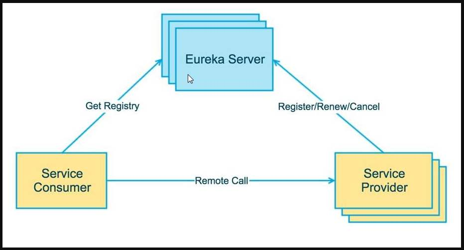
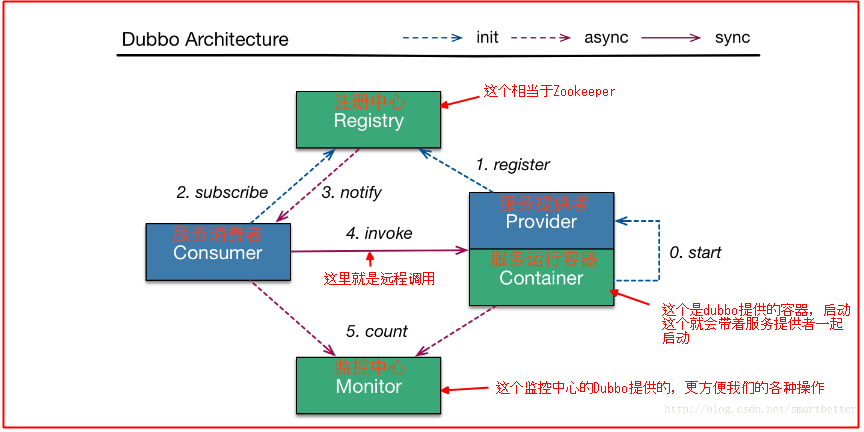

# 01、【初级架构搭建】SpringCloud从零搭建微服务架构视频教程

<!-- MarkdownTOC -->
- [1. 微服务概述与SpringCloud](# 1. 微服务概述与SpringCloud)
- [2. Rest微服务构建案例工程模块](# 2. Rest微服务构建案例工程模块)
  - [2.1.1 构建步骤](### 2.1.1 构建步骤)
  - [2.2 microservicecloud-consumer-dept-80 部门微服务消费者Module](## 2.2 microservicecloud-consumer-dept-80 部门微服务消费者Module)
    - [2.2.1 RestTemplate](### 2.2.1 RestTemplate)
    - [2.2.2 构建步骤](### 2.2.2 构建步骤：)
- [3. Eureka服务注册与发现](# 3. Eureka服务注册与发现)
  - [3.1 Eureka是什么？](## 3.1 Eureka是什么？)
  - [3.2 Eureka原理讲解？](## 3.2 Eureka原理讲解？)
    - [3.2.1 Eureka的基本架构](### 3.2.1 Eureka的基本架构)
    - [3.2.2 三大角色](### 3.2.2 三大角色)
  - [3.3 构建步骤](## 3.3 构建步骤)
    - [3.3.1 microservicecloud-eureka-7001 eureka服务注册中心Module](### 3.3.1 microservicecloud-eureka-7001 eureka服务注册中心Module)
    - [3.3.2 将已有的部门微服务microservicecloud-provider-dept-8001注册进eureka服务中心](### 3.3.2 将已有的部门微服务microservicecloud-provider-dept-8001注册进eureka服务中心)
    - [3.3.3 actuator与注册微服务信息完善](### 3.3.3 actuator与注册微服务信息完善)
<!-- /MarkdownTOC -->


---
---


# 1. 微服务概述与SpringCloud   


# 2. Rest微服务构建案例工程模块   

## 2.1 microservicecloud-provider-dept-8001 部门微服务提供者Module

### 2.1.1 构建步骤   
1. 新建microservicecloud-provider-dept-8001（创建完成后请回到父工程查看pom文件变化）   
2. POM（约定 > 配置> 编码）   
3. YML   
4. 工程src/main/resources目录下新建mybatis文件夹后新建mybatis.cfg.xml文件   
5. MySQL创建部门数据库脚本   
6. DeptDao部门接口   
7. 工程src/main/resources/mybatis目录下新建mapper文件夹后再建DeptMapper.xml   
8. DeptService部门服务接口   
9. DeptServiceImpl部门服务接口实现类   
10. DeptController部门微服务提供者REST   
11. DeptProvider8001_App主启动类DeptProvider8001_App   
12. 测试 http://localhost:8001/dept/list


## 2.2 microservicecloud-consumer-dept-80 部门微服务消费者Module   
### 2.2.1 RestTemplate   
RestTemplate提供了多种便捷访问远程Http服务的方法， 是一种简单便捷的访问restful服务模板类，是Spring提供的用于访问Rest服务的**客户端模板工具集**。

RestTemplate提供了多种便捷访问远程Http服务的方法，是一种简单便捷的访问restful服务模板类，是Spring提供的用于访问Rest服务的客户端模板工具集。

使用：   
使用restTemplate访问restful接口非常的简单粗暴无脑。(url, requestMap, ResponseBean.class)这三个参数分别代表 REST请求地址、请求参数、HTTP响应转换被转换成的对象类型。

官网地址:https://docs.spring.io/spring-framework/docs/4.3.7.RELEASE/javadoc-api/org/springframework/web/client/RestTemplate.html


### 2.2.2 构建步骤   
1. 新建microservicecloud-consumer-dept-80   
2. POM（约定 > 配置> 编码）   
3. YML   
4. com.atguigu.springcloud.cfgbeans包下ConfigBean的编写（类似spring里面的applicationContext.xml写入的注入Bean）   
5. com.atguigu.springcloud.controller包下新建DeptController_Consumer部门微服务消费者REST   
6. DeptConsumer80_App主启动类   
17. 测试 http://localhost/consumer/dept/get/2   
http://localhost/consumer/dept/list   
http://localhost/consumer/dept/add?dname=AI


# 3. Eureka服务注册与发现   

## 3.1 Eureka是什么？   
Eureka是Netflix的一个子模块，也是核心模块之一。Eureka是一个基于REST的服务，用于定位服务，以实现云端中间层服务发现和故障转移。

服务注册与发现对于微服务架构来说是非常重要的，有了服务发现与注册，**只需要使用服务的标识符，就可以访问到服务**，而不需要修改服务调用的配置文件了。**功能类似于dubbo的注册中心，比如Zookeeper**。


## 3.2 Eureka原理讲解？   

### 3.2.1 Eureka的基本架构   

Spring Cloud 封装了 Netflix 公司开发的 Eureka 模块来**实现服务注册和发现**(请对比Zookeeper)。

Eureka 采用了 C-S 的设计架构。Eureka Server 作为服务注册功能的服务器，它是服务注册中心。

而系统中的其他微服务，使用 Eureka 的客户端连接到 Eureka Server并维持心跳连接。这样系统的维护人员就可以通过 Eureka Server 来监控系统中各个微服务是否正常运行。SpringCloud 的一些其他模块（比如Zuul）就可以通过 Eureka Server 来发现系统中的其他微服务，并执行相关的逻辑。


<p align="center">请注意和Dubbo的架构对比</p>   

   

   


**Eureka包含两个组件：Eureka Server 和 Eureka Client**

**Eureka Server提供服务注册服务**。各个节点启动后，会在EurekaServer中进行注册，这样EurekaServer中的服务注册表中将会存储所有可用服务节点的信息，服务节点的信息可以在界面中直观的看到。

**EurekaClient是一个Java客户端**。用于简化Eureka Server的交互，客户端同时也具备一个内置的、使用轮询(round-robin)负载算法的负载均衡器。在应用启动后，将会向Eureka Server发送心跳(默认周期为30秒)。如果Eureka Server在多个心跳周期内没有接收到某个节点的心跳，EurekaServer将会从服务注册表中把这个服务节点移除（默认90秒）。


### 3.2.2 三大角色   
* Eureka Server 提供服务注册和发现   
* Service Provider服务提供方将自身服务注册到Eureka，从而使服务消费方能够找到   
* Service Consumer服务消费方从Eureka获取注册服务列表，从而能够消费服务   


## 3.3 构建步骤     

### 3.3.1 microservicecloud-eureka-7001 eureka服务注册中心Module   
1. 新建microservicecloud-eureka-7001   
2. POM（约定 > 配置> 编码）   
3. YML(需要暴露服务注册地址)   
4. EurekaServer7001_App主启动类(**@EnableEurekaServer**)   
5. 测试 http://localhost:7001/   
No application available 没有服务被发现 O(∩_∩)O因为没有注册服务进来当然不可能有服务被发现


**需要引入cloud的一个新技术组件，基本上两步走**   
1. 新增相关maven坐标   
```
       <!--eureka-server服务端 -->
        <dependency>
            <groupId>org.springframework.cloud</groupId>
            <artifactId>spring-cloud-starter-eureka-server</artifactId>
        </dependency>
```
2. 在主启动类上面，标注启动该新组件技术的相关注解标签   
```
@SpringBootApplication
@EnableEurekaServer
public class EurekaServer7001_App {
    public static void main(String[] args) {
        SpringApplication.run(EurekaServer7001_App.class, args);
    }
}
```

### 3.3.2 将已有的部门微服务(microservicecloud-provider-dept-8001)注册进eureka服务中心   
1. 修改microservicecloud-provider-dept-8001   
2. POM（约定 > 配置> 编码）   
修改部分:   
```
       <!-- 将微服务provider侧注册进eureka -->
        <dependency>
            <groupId>org.springframework.cloud</groupId>
            <artifactId>spring-cloud-starter-eureka</artifactId>
        </dependency>

        <dependency>
            <groupId>org.springframework.cloud</groupId>
            <artifactId>spring-cloud-starter-config</artifactId>
        </dependency>
```
3. YML   
修改部分：   
```
eureka:
  client: #客户端注册进eureka服务列表内
    service-url:
      defaultZone: http://localhost:7001/eureka
```
4. DeptProvider8001_App主启动类(**@EnableEurekaClient**)   
5. 测试 先要启动EurekaServer   
http://localhost:7001/   
微服务注册名(配置在配置文件中spring:application:name: microservicecloud-dept)

### 3.3.3 actuator与注册微服务信息完善   
1. 主机名称:服务名称修改   
EMERGENCY! EUREKA MAY BE INCORRECTLY CLAIMING INSTANCES ARE UP WHEN THEY'RE NOT. RENEWALS ARE LESSER THAN THRESHOLD AND HENCE THE INSTANCES ARE NOT BEING EXPIRED JUST TO BE SAFE.
DS Replicas
Instances currently registered with Eureka


2. 访问信息有IP信息提示   


3. 微服务info内容详细信息   


