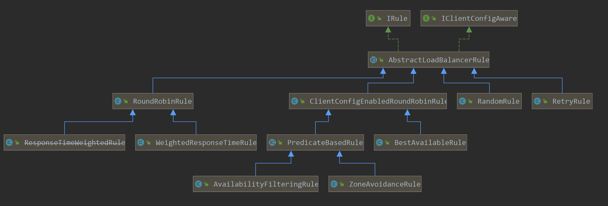

# 01、【初级架构搭建】SpringCloud从零搭建微服务架构视频教程   
<!-- MarkdownTOC -->

- [1. 微服务概述与SpringCloud](#1)
- [2. Rest微服务构建案例工程模块](#2)
  - [2.3 microservicecloud-consumer-dept-80部门微服务消费者Module](#2.3)
  - [2.4 microservicecloud-consumer-dept-80 部门微服务消费者Module](#2.4)
    - [2.4.1 RestTemplate](#2.4.1)
    - [2.4.2 构建步骤](#2.4.2)
- [3. Eureka服务注册与发现](#3)
  - [3.1 Eureka是什么？](#3.1)
  - [3.2 Eureka原理讲解？](#3.2)
    - [3.2.1 Eureka的基本架构](#3.2.1)
    - [3.2.2 三大角色](#3.2.2)
  - [3.3 构建步骤](#3.3)
    - [3.3.1 microservicecloud-eureka-7001 eureka服务注册中心Module](#3.3.1)
    - [3.3.2 将已有的部门微服务microservicecloud-provider-dept-8001注册进eureka服务中心](#3.3.2)
    - [3.3.3 actuator与注册微服务信息完善](#3.3.3)
    - [3.3.4 eureka自我保护](#3.3.4)
    - [3.3.5 microservicecloud-provider-dept-8001服务发现Discovery](#3.3.5)
  - [3.4 集群配置](#3.4)
  - [3.5 作为服务注册中心，Eureka比Zookeeper好在哪里？](#3.5)
- [4. Ribbon负载均衡](#4)
  - [4.1 概述](#4.1)
    - [4.1.1 是什么？](#4.1.1)
    - [4.1.2 能干嘛？](#4.1.2)
  - [4.2 Ribbon配置初步](#4.2)
  - [4.3 Ribbon负载均衡](#4.3)
  - [4.4 Ribbon核心组件IRule](#4.4)
  - [4.5 Ribbon自定义](#4.5)
    - [4.5.1 操作步骤](#4.5.1)
    - [4.5.2 注意配置细节](#4.5.2)
    - [4.5.3 自定义规则深度解析](#4.5.3)
- [5. Feign负载均衡](#5)
  - [5.1 概述](#5.1)
  - [5.2 Feign使用步骤](#5.2)
- [6. Hystrix断路器](#5)
  - [6.1 概述](#6.1)
    - [6.1.1 分布式系统面临的问题](#6.1.1)
    - [6.1.2 Hystrix是什么？](#6.1.2)
    - [6.1.3 能干嘛？](#6.1.3)
  - [6.2 服务熔断](#6.2)
    - [6.2.1 服务熔断是什么？](#6.2.1)
    - [6.2.2 构建步骤](#6.2.2)
  - [6.3 服务降级](#6.3)
  - [6.4 服务监控hystrixDashboard](#6.4)
  
  
<!-- /MarkdownTOC -->


---
---


---
<h1 id="1">1.微服务概述与SpringCloud</h1>   

---

---
<h1 id="2">2.Rest微服务构建案例工程模块</h1>

---

<h2 id="2.3">2.3 microservicecloud-provider-dept-8001 部门微服务提供者Module</h2>   
<h3 id="2.3.1">2.3.1 构建步骤</h3>   

1. 新建microservicecloud-provider-dept-8001（创建完成后请回到父工程查看pom文件变化）   
2. POM（约定 > 配置> 编码）   
3. YML   
4. 工程src/main/resources目录下新建mybatis文件夹后新建mybatis.cfg.xml文件   
5. MySQL创建部门数据库脚本   
6. DeptDao部门接口   
7. 工程src/main/resources/mybatis目录下新建mapper文件夹后再建DeptMapper.xml   
8. DeptService部门服务接口   
9. DeptServiceImpl部门服务接口实现类   
10. DeptController部门微服务提供者REST   
11. DeptProvider8001_App主启动类DeptProvider8001_App   
12. 测试 http://localhost:8001/dept/list


<h2 id="2.4">2.4 microservicecloud-consumer-dept-80 部门微服务消费者Module </h2>   
<h3 id="2.4.1">2.4.1 RestTemplate</h3>    

RestTemplate提供了多种便捷访问远程Http服务的方法， 是一种简单便捷的访问restful服务模板类，是Spring提供的用于访问Rest服务的**客户端模板工具集**。

RestTemplate提供了多种便捷访问远程Http服务的方法，是一种简单便捷的访问restful服务模板类，是Spring提供的用于访问Rest服务的客户端模板工具集。

使用：   
使用restTemplate访问restful接口非常的简单粗暴无脑。(url, requestMap, ResponseBean.class)这三个参数分别代表 REST请求地址、请求参数、HTTP响应转换被转换成的对象类型。

官网地址:https://docs.spring.io/spring-framework/docs/4.3.7.RELEASE/javadoc-api/org/springframework/web/client/RestTemplate.html


<h3 id="2.4.2">2.4.2 构建步骤</h3>   

1. 新建microservicecloud-consumer-dept-80   
2. POM（约定 > 配置> 编码）   
3. YML   
4. com.atguigu.springcloud.cfgbeans包下ConfigBean的编写（类似spring里面的applicationContext.xml写入的注入Bean）   
5. com.atguigu.springcloud.controller包下新建DeptController_Consumer部门微服务消费者REST   
6. DeptConsumer80_App主启动类   
17. 测试 http://localhost/consumer/dept/get/2   
http://localhost/consumer/dept/list   
http://localhost/consumer/dept/add?dname=AI


--- 
<h1 id="3">3. Eureka服务注册与发现</h1>

---

<h2 id="3.1">3.1 Eureka是什么？</h2>   
Eureka是Netflix的一个子模块，也是核心模块之一。Eureka是一个基于REST的服务，用于定位服务，以实现云端中间层服务发现和故障转移。   

服务注册与发现对于微服务架构来说是非常重要的，有了服务发现与注册，**只需要使用服务的标识符，就可以访问到服务**，而不需要修改服务调用的配置文件了。**功能类似于dubbo的注册中心，比如Zookeeper**。

Netflix在设计Eureka时遵守的是AP原则。

<h2 id="3.2">3.2 Eureka原理讲解？</h2>   

<h3 id="3.2.1">3.2.1 Eureka的基本架构</h3>   

Spring Cloud 封装了 Netflix 公司开发的 Eureka 模块来**实现服务注册和发现**(请对比Zookeeper)。

Eureka 采用了 C-S 的设计架构。Eureka Server 作为服务注册功能的服务器，它是服务注册中心。

而系统中的其他微服务，使用 Eureka 的客户端连接到 Eureka Server并维持心跳连接。这样系统的维护人员就可以通过 Eureka Server 来监控系统中各个微服务是否正常运行。SpringCloud 的一些其他模块（比如Zuul）就可以通过 Eureka Server 来发现系统中的其他微服务，并执行相关的逻辑。


<p align="center">请注意和Dubbo的架构对比</p>   

   

   


**Eureka包含两个组件：Eureka Server 和 Eureka Client**

**Eureka Server提供服务注册服务**。各个节点启动后，会在EurekaServer中进行注册，这样EurekaServer中的服务注册表中将会存储所有可用服务节点的信息，服务节点的信息可以在界面中直观的看到。

**EurekaClient是一个Java客户端**。用于简化Eureka Server的交互，客户端同时也具备一个内置的、使用轮询(round-robin)负载算法的负载均衡器。在应用启动后，将会向Eureka Server发送心跳(默认周期为30秒)。如果Eureka Server在多个心跳周期内没有接收到某个节点的心跳，EurekaServer将会从服务注册表中把这个服务节点移除（默认90秒）。


<h3 id="3.2.2">3.2.2 三大角色 </h3>   

* Eureka Server 提供服务注册和发现   
* Service Provider服务提供方将自身服务注册到Eureka，从而使服务消费方能够找到   
* Service Consumer服务消费方从Eureka获取注册服务列表，从而能够消费服务   


<h2 id="3.3">3.3 构建步骤</h2>   

<h3 id="3.3.1">3.3.1 microservicecloud-eureka-7001 eureka服务注册中心Module</h3>   

1. 新建microservicecloud-eureka-7001   
2. POM（约定 > 配置> 编码）   
3. YML(需要暴露服务注册地址)   
4. EurekaServer7001_App主启动类(**@EnableEurekaServer**)   
5. 测试 http://localhost:7001/   
No application available 没有服务被发现 O(∩_∩)O因为没有注册服务进来当然不可能有服务被发现


**需要引入cloud的一个新技术组件，基本上两步走**   
1. 新增相关maven坐标   
```
       <!--eureka-server服务端 -->
        <dependency>
            <groupId>org.springframework.cloud</groupId>
            <artifactId>spring-cloud-starter-eureka-server</artifactId>
        </dependency>
```
2. 在主启动类上面，标注启动该新组件技术的相关注解标签   
```
@SpringBootApplication
@EnableEurekaServer
public class EurekaServer7001_App {
    public static void main(String[] args) {
        SpringApplication.run(EurekaServer7001_App.class, args);
    }
}
```

<h3 id="3.3.2">3.3.2 将已有的部门微服务 microservicecloud-provider-dept-8001 注册进eureka服务中心</h3>   

1. 修改microservicecloud-provider-dept-8001   
2. POM（约定 > 配置> 编码）   
修改部分:   
```
       <!-- 将微服务provider侧注册进eureka -->
        <dependency>
            <groupId>org.springframework.cloud</groupId>
            <artifactId>spring-cloud-starter-eureka</artifactId>
        </dependency>

        <dependency>
            <groupId>org.springframework.cloud</groupId>
            <artifactId>spring-cloud-starter-config</artifactId>
        </dependency>
```
3. YML   
修改部分：   
```
eureka:
  client: #客户端注册进eureka服务列表内
    service-url:
      defaultZone: http://localhost:7001/eureka
```
4. DeptProvider8001_App主启动类(**@EnableEurekaClient**)   
5. 测试 先要启动EurekaServer   
http://localhost:7001/   
微服务注册名(配置在配置文件中spring:application:name: microservicecloud-dept)

<h3 id="3.3.3">3.3.3 actuator与注册微服务信息完善</h3>   

1. 主机名称:服务名称修改   

若在Eureka访问界面，相关服务的Status描述不想使用默认的形式 IP:applicationName:port
我们可以选择配置一个eureka: instance: instance-id: xxx，之后就显示我们配置的信息。

修改服务提供者的YML：   
```
eureka:
  instance:
    instance-id: microservicecloud-dept8001
```

2. 访问信息有IP信息提示   

我的工程不需要修改就默认显示IP。若有需要可以做如下操作   

修改服务提供者的YML：   
```
eureka:
  instance:
    prefer-ip-address: true
```

3. 微服务info内容详细信息   

+ 3.1 当前问题：超链接点击服务报告ErrorPage   
+ 3.2 修改服务提供者POM(microservicecloud-provider-dept-8001)   
```
<dependency>
       <groupId>org.springframework.boot</groupId>
       <artifactId>spring-boot-starter-actuator</artifactId>
</dependency>
```
+ 3.3 总的父工程microservicecloud修改pom.xml添加构建build信息   
```
    <build>
        <finalName>microservicecloud</finalName>
        <resources>
            <resource>
                <directory>src/main/resources</directory>
                <filtering>true</filtering>
            </resource>
        </resources>

        <plugins>
            <plugin>
                <groupId>org.apache.maven.plugins</groupId>
                <artifactId>maven-resources-plugin</artifactId>
                <configuration>
                    <delimiters>
                        <delimit>@</delimit>
                    </delimiters>
                </configuration>
            </plugin>

        </plugins>
    </build>
```

+ 3.4 修改服务提供者YML    
```
info:
  app.name: atguigu-microservicecloud
  company.name: www.atguigu.com
  build.artifactId: @project.artifactId@
  build.version: @project.version@
```

+ 3.5 完整application.yml   
```
server:
  port: 8001

mybatis:
  config-location: classpath:mybatis/mybatis.cfg.xml        # mybatis配置文件所在路径
  type-aliases-package: com.atguigu.springcloud.entities    # 所有Entity别名类所在包
  mapper-locations:
    - classpath:mybatis/mapper/**/*.xml                       # mapper映射文件


spring:
  application:
    name: microservicecloud-dept

  datasource:
    type: com.alibaba.druid.pool.DruidDataSource            # 当前数据源操作类型
    driver-class-name: org.gjt.mm.mysql.Driver              # mysql驱动包
    url: jdbc:mysql://localhost:3306/cloudDB01?useUnicode=true&characterEncoding=utf8&autoReconnect=true&allowMultiQueries=true&useSSL=false&serverTimezone=UTC              # 数据库名称
    username: root
    password: 

    dbcp2:
      min-idle: 5                                           # 数据库连接池的最小维持连接数
      initial-size: 5                                       # 初始化连接数
      max-total: 5                                          # 最大连接数
      max-wait-millis: 200                                  # 等待连接获取的最大超时时间

eureka:
  client: #客户端注册进eureka服务列表内
    service-url:
      defaultZone: http://localhost:7001/eureka
  instance:
    instance-id: microservicecloud-dept8001   #自定义服务名称信息
    prefer-ip-address: true     #访问路径可以显示IP地址

info:
  app.name: atguigu-microservicecloud
  company.name: www.atguigu.com
  build.artifactId: @project.artifactId@
  build.version: @project.version@
```

<p align="center">配置信息显示效果</p>  

   


<h3 id="3.3.4">3.3.4 eureka自我保护</h3>   

Eureka界面出现红字提示："**EMERGENCY! EUREKA MAY BE INCORRECTLY CLAIMING INSTANCES ARE UP WHEN THEY'RE NOT. RENEWALS ARE LESSER THAN THRESHOLD AND HENCE THE INSTANCES ARE NOT BEING EXPIRED JUST TO BE SAFE.**"

导致原因： 某时刻某一个微服务不可用了，eureka不会立刻清理，依旧会对该微服务的信息进行保存。

**什么是自我保护模式**？

默认情况下，如果EurekaServer在一定时间内没有接收到某个微服务实例的心跳，EurekaServer将会注销该实例（默认90秒）。但是当网络分区故障发生时，微服务与EurekaServer之间无法正常通信，以上行为可能变得非常危险了——因为微服务本身其实是健康的，**此时本不应该注销这个微服务**。Eureka通过“自我保护模式”来解决这个问题——当EurekaServer节点在短时间内丢失过多客户端时（可能发生了网络分区故障），那么这个节点就会进入自我保护模式。一旦进入该模式，EurekaServer就会保护服务注册表中的信息，不再删除服务注册表中的数据（也就是不会注销任何微服务）。当网络故障恢复后，该Eureka Server节点会自动退出自我保护模式。

**在自我保护模式中，Eureka Server会保护服务注册表中的信息，不再注销任何服务实例。当它收到的心跳数重新恢复到阈值以上时，该Eureka Server节点就会自动退出自我保护模式。它的设计哲学就是宁可保留错误的服务注册信息，也不盲目注销任何可能健康的服务实例。一句话讲解：好死不如赖活着。**

综上，自我保护模式是一种应对网络异常的安全保护措施。它的架构哲学是宁可同时保留所有微服务（健康的微服务和不健康的微服务都会保留），也不盲目注销任何健康的微服务。使用自我保护模式，可以让Eureka集群更加的健壮、稳定。

 
在Spring Cloud中，可以使用**eureka.server.enable-self-preservation = false** 禁用自我保护模式。


<h3 id="3.3.5">3.3.5 microservicecloud-provider-dept-8001服务发现Discovery</h3>   

对于注册经Eureka里面的微服务，可以通过服务发现来获得该服务的信息。

**具体操作步骤**：
+ 修改microservicecloud-provider-dept-8001工程的DeptController.java
```
    private final DiscoveryClient client;

    public DeptController(DeptService service, @Qualifier("discoveryClient") DiscoveryClient client) {
        this.service = service;
        this.client = client;
    }
    
    @RequestMapping(value = "/dept/discovery", method = RequestMethod.GET)
    public Object discovery() {
        List<String> list = client.getServices();
        System.out.println("**********" + list);

        List<ServiceInstance> srvList = client.getInstances("MICROSERVICECLOUD-DEPT");
        for (ServiceInstance element : srvList) {
            System.out.println(element.getServiceId() + "\t" + element.getHost() + "\t" + element.getPort() + "\t"
                    + element.getUri());
        }
        return this.client;
    }
```
+ 修改服务提供者，DeptProvider8001_App.java主启动类，添加注解标签@**EnableDiscoveryClient**   
+ 自测 先启动EurekaServer，再启动DeptProvider8001_App.java主启动类，http://localhost:80001/dept/discovery   
+ 修改服务消费者，microservicecloud-consumer-dept-80工程的ConsumerDeptController.java，添加如下代码      
```
    /**
     * 测试@EnablediscoveryClient,消费端可以调用服务发现
     * @return
     */
    @RequestMapping(value = "/consumer/dept/discovery")
    public Object discovery() {
        return restTemplate.getForObject(REST_URL_PREFIX + "/dept/discovery", Object.class);
    }
```
+ 自测 启动消费者，访问http://localhost:80/consumer/dept/discovery
 
<h2 id="3.4">3.4 集群配置</h2>   

#### 操作步骤

+ 1. 新建microservicecloud-eureka-7002/microservicecloud-eureka-7003   
+ 2. 按照7001为模板粘贴POM   
+ 3. 修改7002和7003的主启动类   
+ 4. 修改映射配置   
找到C:\Windows\System32\drivers\etc路径下的hosts文件添加下面配置   
```
127.0.0.1 eureka7001.com
127.0.0.1 eureka7002.com
127.0.0.1 eureka7003.com
```
+ 5. 修改3台eureka服务器的yml配置(7001、7002、7003)   
```
# 7003示例
server:
  port: 7003

eureka:
  instance:
    hostname: eureka7003.com #eureka服务端的实例名称
  client:
    register-with-eureka: false     #false表示不向注册中心注册自己。
    fetch-registry: false     #false表示自己端就是注册中心，我的职责就是维护服务实例，并不需要去检索服务
    service-url:
      #单机 defaultZone: http://${eureka.instance.hostname}:${server.port}/eureka/       #设置与Eureka Server交互的地址查询服务和注册服务都需要依赖这个地址（单机）。
      defaultZone: http://eureka7001.com:7001/eureka/,http://eureka7002.com:7002/eureka/
```
+ 6. 修改服务提供者microservicecloud-provider-dept-8001的yml配置，将微服务发布到上面3台eureka集群中   
```
eureka:
  client: #客户端注册进eureka服务列表内
    service-url:
      # defaultZone: http://localhost:7001/eureka   # 单机修改为集群配置
      defaultZone: http://eureka7001.com:7001/eureka/,http://eureka7002.com:7002/eureka/,http://eureka7003.com:7003/eureka/
```

<h2 id="3.5">3.5 作为服务注册中心，Eureka比Zookeeper好在哪里？</h2>

著名的CAP理论指出，一个分布式系统不可能同时满足C(一致性)、A(可用性)和P(分区容错性)。由于分区容错性在是分布式系统中必须要保证的，因此我们只能在A和C之间进行权衡。在此**Zookeeper保证的是CP, 而Eureka则是AP**。

#### Zookeeper保证CP   
当向注册中心查询服务列表时，我们可以容忍注册中心返回的是几分钟以前的注册信息，但不能接受服务直接down掉不可用。也就是说，服务注册功能对可用性的要求要高于一致性。但是zk会出现这样一种情况，当master节点因为网络故障与其他节点失去联系时，剩余节点会重新进行leader选举。问题在于，选举leader的时间太长，30 ~ 120s, 且选举期间整个zk集群都是不可用的，这就导致在选举期间注册服务瘫痪。在云部署的环境下，因网络问题使得zk集群失去master节点是较大概率会发生的事，虽然服务能够最终恢复，但是漫长的选举时间导致的注册长期不可用是不能容忍的。

#### Eureka保证AP   
Eureka看明白了这一点，因此在设计时就优先保证可用性。**Eureka各个节点都是平等的**，几个节点挂掉不会影响正常节点的工作，剩余的节点依然可以提供注册和查询服务。而Eureka的客户端在向某个Eureka注册或时如果发现连接失败，则会自动切换至其它节点，只要有一台Eureka还在，就能保证注册服务可用(保证可用性)，只不过查到的信息可能不是最新的(不保证强一致性)。除此之外，Eureka还有一种自我保护机制，如果在15分钟内超过85%的节点都没有正常的心跳，那么Eureka就认为客户端与注册中心出现了网络故障，此时会出现以下几种情况：    
1. Eureka不再从注册列表中移除因为长时间没收到心跳而应该过期的服务 
2. Eureka仍然能够接受新服务的注册和查询请求，但是不会被同步到其它节点上(即保证当前节点依然可用) 
3. 当网络稳定时，当前实例新的注册信息会被同步到其它节点中

因此，**Eureka可以很好的应对因网络故障导致部分节点失去联系的情况，而不会像zookeeper那样使整个注册服务瘫痪**。

#### 总结   
Eureka作为单纯的服务注册中心来说要比zookeeper更加“专业”，因为注册服务更重要的是可用性，我们可以接受短期内达不到一致性的状况。不过Eureka目前1.X版本的实现是基于servlet的java web应用，它的极限性能肯定会受到影响。期待正在开发之中的2.X版本能够从servlet中独立出来成为单独可部署执行的服务。


---
<h1 id="4">4. Ribbon负载均衡</h1>   

---

<h2 id="4.1">4.1 概述</h2>

<h3 id="4.1.1">4.1.1 是什么？</h3>

Spring Cloud Ribbon是基于Netflix Ribbon实现的一套**客户端负载均衡的工具**。

简单的说，Ribbon是Netflix发布的开源项目，主要功能是提供**客户端的软件负载均衡算法**，将Netflix的中间层服务连接在一起。Ribbon客户端组件提供一系列完善的配置项如连接超时，重试等。简单的说，就是在配置文件中列出Load Balancer（简称LB）后面所有的机器，Ribbon会自动的帮助你基于某种规则（如简单轮询，随机连接等）去连接这些机器。我们也很容易使用Ribbon实现自定义的负载均衡算法。

官网资料：https://github.com/Netflix/ribbon/wiki/Getting-Started

<h3 id="4.1.2">4.1.2 能干嘛？</h3>

**LB**，即**负载均衡(Load Balance)**，在微服务或分布式集群中经常用的一种应用。
* **集中式LB**    
即在服务的消费方和提供方之间使用独立的LB设施(可以是硬件，如F5, 也可以是软件，如nginx), 由该设施负责把访问请求通过某种策略转发至服务的提供方；
* **进程内LB**      
将LB逻辑集成到消费方，消费方从服务注册中心获知有哪些地址可用，然后自己再从这些地址中选择出一个合适的服务器。
Ribbon就属于进程内LB，它只是一个类库，集成于消费方进程，消费方通过它来获取到服务提供方的地址。

负载均衡简单的说就是将用户的请求平摊的分配到多个服务上，从而达到系统的HA。

常见的负载均衡有软件Nginx，LVS，硬件 F5等。

相应的在中间件，例如：dubbo和SpringCloud中均给我们提供了负载均衡，**SpringCloud的负载均衡算法可以自定义**。


<h2 id="4.2">4.2 Ribbon配置初步</h2>

**操作步骤**：
1. 修改消费者microservicecloud-consumer-dept-80工程
2. 修改pom.xml文件，添加如下内容
```
        <!-- Ribbon相关 -->
        <dependency>
            <groupId>org.springframework.cloud</groupId>
            <artifactId>spring-cloud-starter-eureka</artifactId>
        </dependency>
        <dependency>
            <groupId>org.springframework.cloud</groupId>
            <artifactId>spring-cloud-starter-ribbon</artifactId>
        </dependency>
        <dependency>
            <groupId>org.springframework.cloud</groupId>
            <artifactId>spring-cloud-starter-config</artifactId>
        </dependency>
```
3. 修改消费者application.yml 添加Eureka的服务注册地址
```
eureka:
  client:
    register-with-eureka: false
    service-url:
      defaultZone: http://eureka7001.com:7001/eureka/,http://eureka7002.com:7002/eureka/,http://eureka7003.com:7003/eureka/  # Eureka的服务注册地址
```
4. 对ConfigBean进行新注解@**LoadBalanced** 获得Rest时加入Ribbon的配置
```
    @Bean
    @LoadBalanced
    public RestTemplate getRestTemplate() {
        return new RestTemplate();
    }
```
5. 主启动类DeptConsumer80_App.java添加@**EnableEurekaClient**
6. 修改客户端访问类ConsumerDeptController.java
```
@RestController
public class ConsumerDeptController {
    //    private static final String REST_URL_PREFIX = "http://localhost:8001";
    // 通过微服务名字从Eureka上找到并访问
    private static final String REST_URL_PREFIX = "http://MICROSERVICECLOUD-DEPT";
    // ...
}
```
7. 先启动3个eureka集群后，再启动服务提供者microservicecloud-provider-dept-8001并注册进eureka
8. 启动消费者微服务microservicecloud-consumer-dept-80
9. 测试
```
http://localhost/consumer/dept/get/1
http://localhost/consumer/dept/list
http://localhost/consumer/dept/add?dname=大数据部
```
10. 小总结   
Ribbon和Eureka整合后Consumer可以直接调用服务而不用再关心地址和端口号
```
     // 通过微服务名字从Eureka上找到并访问
    private static final String REST_URL_PREFIX = "http://MICROSERVICECLOUD-DEPT";

    private final RestTemplate restTemplate;
```


<h2 id="4.3">4.3 Ribbon负载均衡</h2>

#### 4.3.1 架构说明

<p align="center">Ribbon架构图</p>  

   

**Ribbon在工作时分成两步**:   
1. 先选择 EurekaServer ,它优先选择在同一个区域内负载较少的server。
2. 再根据用户指定的策略，在从server取到的服务注册列表中选择一个地址。

其中Ribbon提供了多种策略：比如轮询、随机和根据响应时间加权。

#### 4.3.2 多服务实例构建步骤
1. 参考服务提供者microservicecloud-provider-dept-8001，新建两份，分别命名为8002，8003
2. 新建8002/8003服务对应的数据库（cloudDB02、cloudDB03），各自微服务分别连各自的数据库
3. 修改8002/8003各自YML（端口、数据库连接、eureka.instance.instance-id）   
变化部分   
```
server:
  port: 8002

 datasource:
    url: jdbc:mysql://localhost:3306/cloudDB02

eureka:
  instance:
    instance-id: microservicecloud-dept8002   #自定义服务名称信息
```

完整内容   
```
server:
  port: 8002

mybatis:
  config-location: classpath:mybatis/mybatis.cfg.xml        # mybatis配置文件所在路径
  type-aliases-package: com.atguigu.springcloud.entities    # 所有Entity别名类所在包
  mapper-locations:
    - classpath:mybatis/mapper/**/*.xml                       # mapper映射文件

spring:
  application:
    name: microservicecloud-dept

  datasource:
    type: com.alibaba.druid.pool.DruidDataSource            # 当前数据源操作类型
    driver-class-name: org.gjt.mm.mysql.Driver              # mysql驱动包
    url: jdbc:mysql://localhost:3306/cloudDB02?useUnicode=true&characterEncoding=utf8&autoReconnect=true&allowMultiQueries=true&useSSL=false&serverTimezone=UTC              # 数据库名称。各自微服务分别连各自的数据库。
    username: root
    password: xxxx

    dbcp2:
      min-idle: 5                                           # 数据库连接池的最小维持连接数
      initial-size: 5                                       # 初始化连接数
      max-total: 5                                          # 最大连接数
      max-wait-millis: 200                                  # 等待连接获取的最大超时时间

eureka:
  client: #客户端注册进eureka服务列表内
    service-url:
      defaultZone: http://eureka7001.com:7001/eureka/,http://eureka7002.com:7002/eureka/,http://eureka7003.com:7003/eureka/
  instance:
    instance-id: microservicecloud-dept8002   #自定义服务名称信息
    prefer-ip-address: true     #访问路径可以显示IP地址

info:
  app.name: atguigu-microservicecloud
  company.name: www.atguigu.com
  build.artifactId: @project.artifactId@
  build.version: @project.version@
```
4. 启动3个eureka集群配置区
5. 启动3个Dept微服务,并各自测试通过

```
http://localhost:8001/dept/list
http://localhost:8002/dept/list
http://localhost:8003/dept/list
```
6. 启动消费者microservicecloud-consumer-dept-80
7. 客户端通过Ribbon完成负载均衡并访问上一步的Dept微服务(**注意观察返回的数据库名字，若各不相同，则负载均衡实现**)
```
http://localhost/consumer/dept/list
```
8. 总结   
Ribbon其实就是一个**软负载均衡的客户端组件**，他可以和其他所需请求的客户端结合使用，和eureka结合只是其中的一个实例。

**注意**: 对外暴露的统一的服务实例名,8001/8002/8003三个名字都要一样
```
spring:
  application:
    name: microservicecloud-dept
```


<h2 id="4.4">4.4 Ribbon核心组件IRule</h2>

#### IRule根据特定算法，从服务列表中选取一个要访问的服务（Ribbon本身自带七种算法）    
1. **RoundRobinRule**    
轮询，依次执行每个执行一次(默认)   
2. **RandomRule**   
随机   
3. **AvailabilityFilteringRule**   
会先过滤掉多次访问故障而处于断路器跳闸状态的服务,并发的连接数量超过阀值得服务，然后对剩余的服务列表安装轮询策略进行访问。
4. **WeightedResponseTimeRule**   
根据平均响应时间计算所有的服务的权重，响应时间越快服务权重越大，容易被选中的概率就越高。
刚启动时，如果统计信息不中，则使用RoundRobinRule(轮询)策略，等统计的信息足够了会自动的切换到WeightedResponseTimeRule。
5. **RetryRule**    
先按照RoundRobinRule(轮询)的策略获取服务，如果获取的服务失败侧在指定的时间会进行重试，进行获取可用的服务。
若多次获取某个服务失败，这不会再再次获取该服务如(高德地图上某条道路堵车，司机不会走那条道路)
6. **BestAvailableRule**   
会先过滤掉由于多次访问故障而处于断路器跳闸状态的服务，然后选择一个并发量最小的服务。
7. **ZoneAvoidanceRule**   
默认规则，复合判断Server所在区域的性能和Server的可用性选择服务器

#### 选择需要的算法，只需在配置类中改变配置即可   
```
    @Bean
    public IRule myRule() {
        return new RandomRule();// 用随机算法替换默认的轮询算法
    }
```

<p align="center">Ribbion的负载均衡算法继承关系图</p>   

 


<h2 id="4.5">4.5 Ribbon自定义</h2>

源码地址：https://github.com/Netflix/ribbon

<h3 id="4.5.1">4.5.1 操作步骤</h3>

1. 修改消费者工程microservicecloud-consumer-dept-80   
2. 主启动类DeptConsumer80_App.java添加注解@**RibbonClient**  
```
@RibbonClient(name="对外曝光微服务的名称",configuration=自定义的Rlue配置类.class)
```
3. 新建package com.gtguigu.ribbonrule，创建自定义规则类MySelfRule.java，首先简单配置为随机规则   
```
@Configuration
public class MySelfRule {
    @Bean
    public IRule myRule() {
        return new RandomRule();// 用随机算法替换默认的轮询算法
    }
}
```
4. 修改主启动类   
```
@SpringBootApplication
@EnableEurekaClient
@RibbonClient(name = "MICROSERVICECLOUD-DEPT", configuration = MySelfRule.class)
public class DeptConsumer80_App {
    public static void main(String[] args) {
        SpringApplication.run(DeptConsumer80_App.class, args);
    }
}

```
5. 测试自定义的规则（先简单配置为随机规则）是否成功启动(7001/7002/7003->8001/8002/8003->80)
```
http://localhost/consumer/dept/get/1
```

<h3 id="4.5.2">4.5.2 注意配置细节</h3>

1. 官方文档明确给出了**警告**：自定义的Rlue配置类不放在@ComponentScan注解所扫描的当前包下以及该子包下，否则自定义的配置类就会被所有的Ribbon客户端共享，也就达不到特殊制定的目的。

2. 注解@ComponentScan就在@SpringBootApplication中，所以需要创建一个类不在当前工程注解@ComponentScan的同包或者子包中。

3. 当自定义了IRule,若ConfigBean配置类中存在相关的IRule，则已经不能获取该配置（需要删除）,因为系统使用的是在主启动类里@**RibbonClient**对应的规则。


<h3 id="4.5.3">4.5.3 自定义规则深度解析</h3>

1. **需求**:依旧使用默认的轮询策略，但是加上新的需求,每个服务器要求被调用5次。即之前一台机器执行一次，现在是每台机器执行5次
2. **解析源码**   
```
https://github.com/Netflix/ribbon/blob/master/ribbon-loadbalancer/src/main/java/com/netflix/loadbalancer/RandomRule.java
```
3. 参考源码RandomRule.java，在自定义MySelfRule.java类同包中创建一个算法类(InvokingFiveTimesRule.java)   
```
public class InvokingFiveTimesRule extends AbstractLoadBalancerRule {
    //    Random rand = new Random();
    private int total = 0;            // 总共被调用的次数，目前要求每台被调用5次
    private int currentIndex = 0;    // 当前提供服务的机器号

    public InvokingFiveTimesRule() {
    }

    @SuppressWarnings({"RCN_REDUNDANT_NULLCHECK_OF_NULL_VALUE"})
    public Server choose(ILoadBalancer lb, Object key) {
        if (lb == null) {
            return null;
        } else {
            Server server = null;

            while (server == null) {
                if (Thread.interrupted()) {
                    return null;
                }

                List<Server> upList = lb.getReachableServers();
                List<Server> allList = lb.getAllServers();
                int serverCount = allList.size();
                if (serverCount == 0) {
                    return null;
                }

//                int index = this.rand.nextInt(serverCount);
//                server = (Server)upList.get(index);

                // 自定义算法 begin
                if (total < 5) {
                    server = upList.get(currentIndex);
                    total++;
                } else {
                    total = 0;
                    currentIndex++;
                    if (currentIndex >= upList.size()) {
                        currentIndex = 0;
                    }
                }
                // 自定义算法 end

                if (server == null) {
                    Thread.yield();
                } else {
                    if (server.isAlive()) {
                        return server;
                    }

                    server = null;
                    Thread.yield();
                }
            }

            return server;
        }
    }

    public Server choose(Object key) {
        return this.choose(this.getLoadBalancer(), key);
    }

    public void initWithNiwsConfig(IClientConfig clientConfig) {
    }
}
```
4. 把MySelfRule.java类的返回值修改成当前自定义规则类
```
@Configuration
public class MySelfRule {
    @Bean
    public IRule myRule() {
//        return new RandomRule();// 用随机算法替换默认的轮询算法
        return new InvokingFiveTimesRule();
    }
}
```
5. 测试自定义规则是否成功，启动(7001/7002/7003->8001/8002/8003->80)看看是否是执行的5次
```
http://localhost/consumer/dept/get/1
```


<h1 id="5">5. Feign负载均衡</h1>

<h2 id="5.1">5.1 概述</h2>

### 5.1.1 官网解释
http://projects.spring.io/spring-cloud/spring-cloud.html#spring-cloud-feign


**Declarative REST Client: Feign**   
[**Feign**](https://github.com/Netflix/feign) is a declarative web service client. It makes writing web service clients easier. To use Feign create an interface and annotate it. It has pluggable annotation support including Feign annotations and JAX-RS annotations. Feign also supports pluggable encoders and decoders. Spring Cloud adds support for Spring MVC annotations and for using the same HttpMessageConverters used by default in Spring Web. Spring Cloud integrates Ribbon and Eureka to provide a load balanced http client when using Feign.

Feign是一个声明式WebService客户端。使用Feign能让编写Web Service客户端更加简单, 它的使用方法是**定义一个接口，然后在上面添加注解**，同时也支持JAX-RS标准的注解。Feign也支持可拔插式的编码器和解码器。Spring Cloud对Feign进行了封装，使其支持了Spring MVC标准注解和HttpMessageConverters。Feign可以与Eureka和Ribbon组合使用以支持负载均衡。

参考官网：https://github.com/OpenFeign/feign

### 5.1.2 Feign能干什么

Feign旨在使编写Java Http客户端变得更容易。

前面在使用Ribbon+RestTemplate时，利用RestTemplate对http请求的封装处理，形成了一套模版化的调用方法。但是在实际开发中，由于对服务依赖的调用可能不止一处，**往往一个接口会被多处调用，所以通常都会针对每个微服务自行封装一些客户端类来包装这些依赖服务的调用**。所以，Feign在此基础上做了进一步封装，由他来帮助我们定义和实现依赖服务接口的定义。在Feign的实现下，我们只需创建一个接口并使用注解的方式来配置它(以前是Dao接口上面标注Mapper注解,现在是一个微服务接口上面标注一个Feign注解即可)，即可完成对服务提供方的接口绑定，简化了使用Spring cloud Ribbon时，自动封装服务调用客户端的开发量。

### 5.1.3 Feign集成了Ribbon

利用Ribbon维护了MicroServiceCloud-Dept的服务列表信息，并且通过轮询实现了客户端的负载均衡。而与Ribbon不同的是，**通过feign只需要定义服务绑定接口且以声明式的方法**，优雅而简单的实现了服务调用。


<h2 id="5.2">5.2 Feign使用步骤</h2>

1. 参考消费者microservicecloud-consumer-dept-80
2. 新建消费者microservicecloud-consumer-dept-feign   
* 修改主启动类名字 DeptConsumer80_Feign_App   
3. 修改microservicecloud-consumer-dept-feign工程的pom.xml，添加对feign的支持
4. 修改microservicecloud-api工程
* pom.xml
```
       <!--添加feign客户端支持-->
        <dependency>
            <groupId>org.springframework.cloud</groupId>
            <artifactId>spring-cloud-starter-feign</artifactId>
        </dependency>
```
* 新建DeptClientService.java接口(方法名与调用服务端接口DeptService.java里方法名一致),并新增注解@**FeignClient**  
```
@FeignClient(value = "MICROSERVICECLOUD-DEPT")
public interface DeptClientService {

    @RequestMapping(value = "/dept/add", method = RequestMethod.POST)
    boolean add(Dept dept);

    @RequestMapping(value = "/dept/get/{id}", method = RequestMethod.GET)
    Dept get(@PathVariable("id") Long id);

    @RequestMapping(value = "/dept/list", method = RequestMethod.GET)
    List<Dept> list();
}
```
* mvn clean   
* mvn install
5. 修改microservicecloud-consumer-dept-feign工程的Controller，使用上一步新建的DeptClientService.java接口
6. microservicecloud-consumer-dept-feign工程主启动类添加注解@**EnableFeignClients**
```
@SpringBootApplication
@EnableEurekaClient
@EnableFeignClients
public class DeptConsumer80_Feign_App {
    public static void main(String[] args) {
        SpringApplication.run(DeptConsumer80_Feign_App.class, args);
    }
}
```
7. 测试，启动(7001/7002/7003->8001/8002/8003->Feign消费者)
```
http://localhost/consumer/dept/list
```
8. 小结   
Feign通过接口的方法调用Rest服务（之前是Ribbon+RestTemplate），该请求发送给Eureka服务器（http://MICROSERVICECLOUD-DEPT/dept/list）,
通过Feign直接找到服务接口，由于在进行服务调用的时候融合了Ribbon技术，所以也支持负载均衡作用。


<h1 id="6">6. Hystrix断路器</h1>

<h2 id="6.1">6.1 概述</h2>

<h3 id="6.1.1">6.1.1 分布式系统面临的问题</h3>

**分布式系统面临的问题**   
复杂分布式体系结构中的应用程序有数十个依赖关系，每个依赖关系在某些时候将不可避免地失败。

**服务雪崩**   
多个微服务之间调用的时候，假设微服务A调用微服务B和微服务C，微服务B和微服务C又调用其它的微服务，这就是所谓的“**扇出**”。如果扇出的链路上某个微服务的调用响应时间过长或者不可用，对微服务A的调用就会占用越来越多的系统资源，进而引起系统崩溃，所谓的“雪崩效应”.

对于高流量的应用来说，单一的后端依赖可能会导致所有服务器上的所有资源都在几秒钟内饱和。比失败更糟糕的是，这些应用程序还可能导致服务之间的延迟增加，备份队列，线程和其他系统资源紧张，导致整个系统发生更多的级联故障。这些都表示需要对故障和延迟进行隔离和管理，以便单个依赖关系的失败，不能取消整个应用程序或系统。

<h3 id="6.1.2">6.1.2 Hystrix是什么？</h3>

Hystrix是一个用于处理分布式系统的**延迟**和**容错**的开源库，在分布式系统里，许多依赖不可避免的会调用失败，比如超时、异常等，Hystrix能够保证在一个依赖出问题的情况下，**不会导致整体服务失败，避免级联故障，以提高分布式系统的弹性**。

“断路器”本身是一种开关装置，当某个服务单元发生故障之后，通过断路器的故障监控（类似熔断保险丝），**向调用方返回一个符合预期的、可处理的备选响应（FallBack），而不是长时间的等待或者抛出调用方无法处理的异常**，这样就保证了服务调用方的线程不会被长时间、不必要地占用，从而避免了故障在分布式系统中的蔓延，乃至雪崩。

官网资料： https://github.com/Netflix/Hystrix/wiki/How-To-Use

<h3 id="6.1.3">6.1.3 能干嘛？</h3>

* 服务熔断
* 服务降级
* 服务限流
* 接近实时的监控
* ......


<h2 id="6.2">6.2 服务熔断</h2>

<h3 id="6.2.1">6.2.1 服务熔断是什么？</h3>

熔断机制是应对雪崩效应的一种微服务链路保护机制。

当扇出链路的某个微服务不可用或者响应时间太长时，会进行服务的降级，进而熔断该节点微服务的调用，快速返回"错误"的响应信息。当检测到该节点微服务调用响应正常后恢复调用链路。在SpringCloud框架里熔断机制通过Hystrix实现。Hystrix会监控微服务间调用的状况，当失败的调用到一定阈值，缺省是5秒内20次调用失败就会启动熔断机制。熔断机制的注解是@**HystrixCommand**。

<h3 id="6.2.2">6.2.2 构建步骤</h3>

1. 参考服务提供者microservicecloud-provider-dept-8001
2. 新建服务提供者microservicecloud-provider-dept-hystrix-8001
3. 修改pom.xml
```
        <!--  添加hystrix支持 -->
        <dependency>
            <groupId>org.springframework.cloud</groupId>
            <artifactId>spring-cloud-starter-hystrix</artifactId>
        </dependency>
```
4. 修改application.yml
```
eureka:
  instance:
    instance-id: microservicecloud-dept8001-hystrix   #自定义服务名称信息
```
5. 修改DeptController.java添加新注解@**HystrixCommand**
```
@RestController
public class DeptController {
    private final DeptService service;
    private final DiscoveryClient client;

    public DeptController(DeptService service, @Qualifier("discoveryClient") DiscoveryClient client) {
        this.service = service;
        this.client = client;
    }

    @RequestMapping(value = "/dept/get/{id}", method = RequestMethod.GET)
    @HystrixCommand(fallbackMethod = "processHystrix_Get")
    public Dept get(@PathVariable("id") Long id) {
        Dept dept = this.service.get(id);
        if (null == dept) {
            throw new RuntimeException("该ID：" + id + "没有没有对应的信息");
        }
        return dept;
    }

    public Dept processHystrix_Get(@PathVariable("id") Long id) {
        return new Dept().setDeptno(id)
                .setDname("该ID：" + id + "没有没有对应的信息,null--@HystrixCommand")
                .setDb_source("no this database in MySQL");
    }
}
```
一旦调用服务方法失败并抛出了错误信息后，会自动调用@HystrixCommand标注好的fallbackMethod指定的方法   
6. 修改服务提供者主启动类DeptProvider8001_Hystrix_App.java,添加新注解@**EnableCircuitBreaker**
```
@SpringBootApplication
@MapperScan("com.atguigu.springcloud.dao")
@EnableEurekaClient
@EnableDiscoveryClient
public class DeptProvider8001_App {
    public static void main(String[] args) {
        SpringApplication.run(DeptProvider8001_App.class, args);
    }
}
```
7. 测试，启动(7001/7002/7003->8001_Hystrix->80消费者)


<h2 id="6.3">6.3 服务降级</h2>

<h3 id="6.2.1">6.2.1 服务降级是什么？</h3>

整体资源快不够了，忍痛将某些服务先关掉，待渡过难关，再开启回来。

服务降级处理是在**客户端实现完成的，与服务端没有关系**。

<h3 id="6.2.2">6.2.2 构建步骤</h3>

1. 修改microservicecloud-api工程,根据已经有的DeptClientService接口，新建一个实现了FallbackFactory接口的类DeptClientServiceFallbackFactory.java。  **注意**：千万不要忘记在类上面新增@Component注解，大坑！！！
```
@Component
public class DeptClientServiceFallbackFactory implements FallbackFactory<DeptClientService> {
    @Override
    public DeptClientService create(Throwable throwable) {
        return new DeptClientService() {
            @Override
            public Dept get(Long id) {
                return new Dept().setDeptno(id)
                        .setDname("该ID：" + id + "没有没有对应的信息,Consumer客户端提供的降级信息,此刻服务Provider已经关闭")
                        .setDb_source("no this database in MySQL");
            }

            @Override
            public List<Dept> list() {
                return null;
            }

            @Override
            public boolean add(Dept dept) {
                return false;
            }
        };
    }
}
```
2. 在接口DeptClientService.java的注解@FeignClient中添加fallbackFactory属性值（microservicecloud-api工程）
```
//@FeignClient(value = "MICROSERVICECLOUD-DEPT")
@FeignClient(value = "microservicecloud-dept", fallbackFactory = DeptClientServiceFallbackFactory.class)
```
3. microservicecloud-api工程 mvn clean install
4. 修改服务消费者microservicecloud-consumer-dept-feign工程的application.yml
```
# 添加对hystrix的支持
feign:
  hystrix:
    enabled: ture
```
5. 测试，启动(7001/7002/7003->8001->Feign消费者)   
* 正常访问测试```http://localhost/consumer/dept/get/1```
* 故意关闭微服务microservicecloud-provider-dept-8001
客户端自己调用提示
```
{
    "deptno": 1,
    "dname": "该ID：1没有没有对应的信息,Consumer客户端提供的降级信息,此刻服务Provider已经关闭",
    "db_source": "no this database in MySQL"
}
```
此时服务端provider已经down了，但是我们做了服务降级处理，让客户端在服务端不可用时也会获得提示信息而不会挂起耗死服务器。不使用hystrix则提示```connect timed out executing GET http://MICROSERVICECLOUD-DEPT/dept/get/1```


<h2 id="6.4">6.4 服务监控hystrixDashboard</h2>


