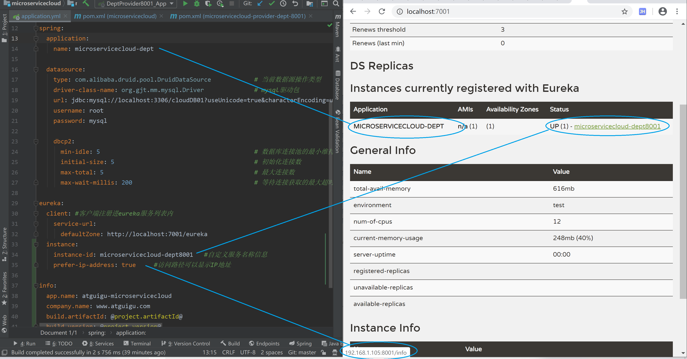

# 01、【初级架构搭建】SpringCloud从零搭建微服务架构视频教程   
<!-- MarkdownTOC -->

- [1. 微服务概述与SpringCloud](#1)
- [2. Rest微服务构建案例工程模块](#2)
  - [2.3 microservicecloud-consumer-dept-80部门微服务消费者Module](#2.3)
  - [2.4 microservicecloud-consumer-dept-80 部门微服务消费者Module](#2.4)
    - [2.4.1 RestTemplate](#2.4.1)
    - [2.4.2 构建步骤](#2.4.2)
- [3. Eureka服务注册与发现](#3)
  - [3.1 Eureka是什么？](#3.1)
  - [3.2 Eureka原理讲解？](#3.2)
    - [3.2.1 Eureka的基本架构](#3.2.1)
    - [3.2.2 三大角色](#3.2.2)
  - [3.3 构建步骤](#3.3)
    - [3.3.1 microservicecloud-eureka-7001 eureka服务注册中心Module](#3.3.1)
    - [3.3.2 将已有的部门微服务microservicecloud-provider-dept-8001注册进eureka服务中心](#3.3.2)
    - [3.3.3 actuator与注册微服务信息完善](#3.3.3)
    - [3.3.4 eureka自我保护](#3.3.4)
    - [3.3.5 microservicecloud-provider-dept-8001服务发现Discovery](#3.3.5)
  - [3.4 集群配置](#3.4)

<!-- /MarkdownTOC -->


---
---


---
<h1 id="1">1.微服务概述与SpringCloud</h1>   

---

---
<h1 id="2">2.Rest微服务构建案例工程模块</h1>

---

<h2 id="2.3">2.3 microservicecloud-provider-dept-8001 部门微服务提供者Module</h2>   
<h3 id="2.3.1">2.3.1 构建步骤</h3>   

1. 新建microservicecloud-provider-dept-8001（创建完成后请回到父工程查看pom文件变化）   
2. POM（约定 > 配置> 编码）   
3. YML   
4. 工程src/main/resources目录下新建mybatis文件夹后新建mybatis.cfg.xml文件   
5. MySQL创建部门数据库脚本   
6. DeptDao部门接口   
7. 工程src/main/resources/mybatis目录下新建mapper文件夹后再建DeptMapper.xml   
8. DeptService部门服务接口   
9. DeptServiceImpl部门服务接口实现类   
10. DeptController部门微服务提供者REST   
11. DeptProvider8001_App主启动类DeptProvider8001_App   
12. 测试 http://localhost:8001/dept/list


<h2 id="2.4">2.4 microservicecloud-consumer-dept-80 部门微服务消费者Module </h2>   
<h3 id="2.4.1">2.4.1 RestTemplate</h3>    

RestTemplate提供了多种便捷访问远程Http服务的方法， 是一种简单便捷的访问restful服务模板类，是Spring提供的用于访问Rest服务的**客户端模板工具集**。

RestTemplate提供了多种便捷访问远程Http服务的方法，是一种简单便捷的访问restful服务模板类，是Spring提供的用于访问Rest服务的客户端模板工具集。

使用：   
使用restTemplate访问restful接口非常的简单粗暴无脑。(url, requestMap, ResponseBean.class)这三个参数分别代表 REST请求地址、请求参数、HTTP响应转换被转换成的对象类型。

官网地址:https://docs.spring.io/spring-framework/docs/4.3.7.RELEASE/javadoc-api/org/springframework/web/client/RestTemplate.html


<h3 id="2.4.2">2.4.2 构建步骤</h3>   

1. 新建microservicecloud-consumer-dept-80   
2. POM（约定 > 配置> 编码）   
3. YML   
4. com.atguigu.springcloud.cfgbeans包下ConfigBean的编写（类似spring里面的applicationContext.xml写入的注入Bean）   
5. com.atguigu.springcloud.controller包下新建DeptController_Consumer部门微服务消费者REST   
6. DeptConsumer80_App主启动类   
17. 测试 http://localhost/consumer/dept/get/2   
http://localhost/consumer/dept/list   
http://localhost/consumer/dept/add?dname=AI


--- 
<h1 id="3">3. Eureka服务注册与发现</h1>

---

<h2 id="3.1">3.1 Eureka是什么？</h2>   
Eureka是Netflix的一个子模块，也是核心模块之一。Eureka是一个基于REST的服务，用于定位服务，以实现云端中间层服务发现和故障转移。

服务注册与发现对于微服务架构来说是非常重要的，有了服务发现与注册，**只需要使用服务的标识符，就可以访问到服务**，而不需要修改服务调用的配置文件了。**功能类似于dubbo的注册中心，比如Zookeeper**。


<h2 id="3.2">3.2 Eureka原理讲解？</h2>   

<h3 id="3.2.1">3.2.1 Eureka的基本架构</h3>   

Spring Cloud 封装了 Netflix 公司开发的 Eureka 模块来**实现服务注册和发现**(请对比Zookeeper)。

Eureka 采用了 C-S 的设计架构。Eureka Server 作为服务注册功能的服务器，它是服务注册中心。

而系统中的其他微服务，使用 Eureka 的客户端连接到 Eureka Server并维持心跳连接。这样系统的维护人员就可以通过 Eureka Server 来监控系统中各个微服务是否正常运行。SpringCloud 的一些其他模块（比如Zuul）就可以通过 Eureka Server 来发现系统中的其他微服务，并执行相关的逻辑。


<p align="center">请注意和Dubbo的架构对比</p>   

   

   


**Eureka包含两个组件：Eureka Server 和 Eureka Client**

**Eureka Server提供服务注册服务**。各个节点启动后，会在EurekaServer中进行注册，这样EurekaServer中的服务注册表中将会存储所有可用服务节点的信息，服务节点的信息可以在界面中直观的看到。

**EurekaClient是一个Java客户端**。用于简化Eureka Server的交互，客户端同时也具备一个内置的、使用轮询(round-robin)负载算法的负载均衡器。在应用启动后，将会向Eureka Server发送心跳(默认周期为30秒)。如果Eureka Server在多个心跳周期内没有接收到某个节点的心跳，EurekaServer将会从服务注册表中把这个服务节点移除（默认90秒）。


<h3 id="3.2.2">3.2.2 三大角色 </h3>   

* Eureka Server 提供服务注册和发现   
* Service Provider服务提供方将自身服务注册到Eureka，从而使服务消费方能够找到   
* Service Consumer服务消费方从Eureka获取注册服务列表，从而能够消费服务   


<h2 id="3.3">3.3 构建步骤</h2>   

<h3 id="3.3.1">3.3.1 microservicecloud-eureka-7001 eureka服务注册中心Module</h3>   

1. 新建microservicecloud-eureka-7001   
2. POM（约定 > 配置> 编码）   
3. YML(需要暴露服务注册地址)   
4. EurekaServer7001_App主启动类(**@EnableEurekaServer**)   
5. 测试 http://localhost:7001/   
No application available 没有服务被发现 O(∩_∩)O因为没有注册服务进来当然不可能有服务被发现


**需要引入cloud的一个新技术组件，基本上两步走**   
1. 新增相关maven坐标   
```
       <!--eureka-server服务端 -->
        <dependency>
            <groupId>org.springframework.cloud</groupId>
            <artifactId>spring-cloud-starter-eureka-server</artifactId>
        </dependency>
```
2. 在主启动类上面，标注启动该新组件技术的相关注解标签   
```
@SpringBootApplication
@EnableEurekaServer
public class EurekaServer7001_App {
    public static void main(String[] args) {
        SpringApplication.run(EurekaServer7001_App.class, args);
    }
}
```

<h3 id="3.3.2">3.3.2 将已有的部门微服务 microservicecloud-provider-dept-8001 注册进eureka服务中心</h3>   

1. 修改microservicecloud-provider-dept-8001   
2. POM（约定 > 配置> 编码）   
修改部分:   
```
       <!-- 将微服务provider侧注册进eureka -->
        <dependency>
            <groupId>org.springframework.cloud</groupId>
            <artifactId>spring-cloud-starter-eureka</artifactId>
        </dependency>

        <dependency>
            <groupId>org.springframework.cloud</groupId>
            <artifactId>spring-cloud-starter-config</artifactId>
        </dependency>
```
3. YML   
修改部分：   
```
eureka:
  client: #客户端注册进eureka服务列表内
    service-url:
      defaultZone: http://localhost:7001/eureka
```
4. DeptProvider8001_App主启动类(**@EnableEurekaClient**)   
5. 测试 先要启动EurekaServer   
http://localhost:7001/   
微服务注册名(配置在配置文件中spring:application:name: microservicecloud-dept)

<h3 id="3.3.3">3.3.3 actuator与注册微服务信息完善</h3>   

1. 主机名称:服务名称修改   

若在Eureka访问界面，相关服务的Status描述不想使用默认的形式 IP:applicationName:port
我们可以选择配置一个eureka: instance: instance-id: xxx，之后就显示我们配置的信息。

修改服务提供者的YML：   
```
eureka:
  instance:
    instance-id: microservicecloud-dept8001
```

2. 访问信息有IP信息提示   

我的工程不需要修改就默认显示IP。若有需要可以做如下操作   

修改服务提供者的YML：   
```
eureka:
  instance:
    prefer-ip-address: true
```

3. 微服务info内容详细信息   

+ 3.1 当前问题：超链接点击服务报告ErrorPage   
+ 3.2 修改服务提供者POM(microservicecloud-provider-dept-8001)   
```
<dependency>
       <groupId>org.springframework.boot</groupId>
       <artifactId>spring-boot-starter-actuator</artifactId>
</dependency>
```
+ 3.3 总的父工程microservicecloud修改pom.xml添加构建build信息   
```
    <build>
        <finalName>microservicecloud</finalName>
        <resources>
            <resource>
                <directory>src/main/resources</directory>
                <filtering>true</filtering>
            </resource>
        </resources>

        <plugins>
            <plugin>
                <groupId>org.apache.maven.plugins</groupId>
                <artifactId>maven-resources-plugin</artifactId>
                <configuration>
                    <delimiters>
                        <delimit>@</delimit>
                    </delimiters>
                </configuration>
            </plugin>

        </plugins>
    </build>
```

+ 3.4 修改服务提供者YML    
```
info:
  app.name: atguigu-microservicecloud
  company.name: www.atguigu.com
  build.artifactId: @project.artifactId@
  build.version: @project.version@
```

+ 3.5 完整application.yml   
```
server:
  port: 8001

mybatis:
  config-location: classpath:mybatis/mybatis.cfg.xml        # mybatis配置文件所在路径
  type-aliases-package: com.atguigu.springcloud.entities    # 所有Entity别名类所在包
  mapper-locations:
    - classpath:mybatis/mapper/**/*.xml                       # mapper映射文件


spring:
  application:
    name: microservicecloud-dept

  datasource:
    type: com.alibaba.druid.pool.DruidDataSource            # 当前数据源操作类型
    driver-class-name: org.gjt.mm.mysql.Driver              # mysql驱动包
    url: jdbc:mysql://localhost:3306/cloudDB01?useUnicode=true&characterEncoding=utf8&autoReconnect=true&allowMultiQueries=true&useSSL=false&serverTimezone=UTC              # 数据库名称
    username: root
    password: 

    dbcp2:
      min-idle: 5                                           # 数据库连接池的最小维持连接数
      initial-size: 5                                       # 初始化连接数
      max-total: 5                                          # 最大连接数
      max-wait-millis: 200                                  # 等待连接获取的最大超时时间

eureka:
  client: #客户端注册进eureka服务列表内
    service-url:
      defaultZone: http://localhost:7001/eureka
  instance:
    instance-id: microservicecloud-dept8001   #自定义服务名称信息
    prefer-ip-address: true     #访问路径可以显示IP地址

info:
  app.name: atguigu-microservicecloud
  company.name: www.atguigu.com
  build.artifactId: @project.artifactId@
  build.version: @project.version@
```

<p align="center">配置信息显示效果</p>  

   


<h3 id="3.3.4">3.3.4 eureka自我保护</h3>   

Eureka界面出现红字提示："**EMERGENCY! EUREKA MAY BE INCORRECTLY CLAIMING INSTANCES ARE UP WHEN THEY'RE NOT. RENEWALS ARE LESSER THAN THRESHOLD AND HENCE THE INSTANCES ARE NOT BEING EXPIRED JUST TO BE SAFE.**"

导致原因： 某时刻某一个微服务不可用了，eureka不会立刻清理，依旧会对该微服务的信息进行保存。

**什么是自我保护模式**？

默认情况下，如果EurekaServer在一定时间内没有接收到某个微服务实例的心跳，EurekaServer将会注销该实例（默认90秒）。但是当网络分区故障发生时，微服务与EurekaServer之间无法正常通信，以上行为可能变得非常危险了——因为微服务本身其实是健康的，**此时本不应该注销这个微服务**。Eureka通过“自我保护模式”来解决这个问题——当EurekaServer节点在短时间内丢失过多客户端时（可能发生了网络分区故障），那么这个节点就会进入自我保护模式。一旦进入该模式，EurekaServer就会保护服务注册表中的信息，不再删除服务注册表中的数据（也就是不会注销任何微服务）。当网络故障恢复后，该Eureka Server节点会自动退出自我保护模式。

**在自我保护模式中，Eureka Server会保护服务注册表中的信息，不再注销任何服务实例。当它收到的心跳数重新恢复到阈值以上时，该Eureka Server节点就会自动退出自我保护模式。它的设计哲学就是宁可保留错误的服务注册信息，也不盲目注销任何可能健康的服务实例。一句话讲解：好死不如赖活着。**

综上，自我保护模式是一种应对网络异常的安全保护措施。它的架构哲学是宁可同时保留所有微服务（健康的微服务和不健康的微服务都会保留），也不盲目注销任何健康的微服务。使用自我保护模式，可以让Eureka集群更加的健壮、稳定。

 
在Spring Cloud中，可以使用**eureka.server.enable-self-preservation = false** 禁用自我保护模式。


<h3 id="3.3.5">3.3.5 microservicecloud-provider-dept-8001服务发现Discovery</h3>   

对于注册经Eureka里面的微服务，可以通过服务发现来获得该服务的信息。

**具体操作步骤**：
+ 修改microservicecloud-provider-dept-8001工程的DeptController.java
```
    private final DiscoveryClient client;

    public DeptController(DeptService service, @Qualifier("discoveryClient") DiscoveryClient client) {
        this.service = service;
        this.client = client;
    }
    
    @RequestMapping(value = "/dept/discovery", method = RequestMethod.GET)
    public Object discovery() {
        List<String> list = client.getServices();
        System.out.println("**********" + list);

        List<ServiceInstance> srvList = client.getInstances("MICROSERVICECLOUD-DEPT");
        for (ServiceInstance element : srvList) {
            System.out.println(element.getServiceId() + "\t" + element.getHost() + "\t" + element.getPort() + "\t"
                    + element.getUri());
        }
        return this.client;
    }
```
+ 修改服务提供者，DeptProvider8001_App.java主启动类，添加注解标签@**EnableDiscoveryClient**   
+ 自测 先启动EurekaServer，再启动DeptProvider8001_App.java主启动类，http://localhost:80001/dept/discovery   
+ 修改服务消费者，microservicecloud-consumer-dept-80工程的ConsumerDeptController.java，添加如下代码      
```
    /**
     * 测试@EnablediscoveryClient,消费端可以调用服务发现
     * @return
     */
    @RequestMapping(value = "/consumer/dept/discovery")
    public Object discovery() {
        return restTemplate.getForObject(REST_URL_PREFIX + "/dept/discovery", Object.class);
    }
```
+ 自测 启动消费者，访问http://localhost:80/consumer/dept/discovery
 
<h2 id="3.4">3.4 集群配置</h2>   


修改映射配置
    找到C:\Windows\System32\drivers\etc路径下的hosts文件
    修改映射配置添加进hosts文件
      127.0.0.1 eureka7001.com	
      127.0.0.1 eureka7002.com
      127.0.0.1 eureka7003.com

3台eureka服务器的yml配置
    7001  7002  7003

microservicecloud-provider-dept-8001微服务发布到上面3台eureka集群配置中

#### 操作步骤

+ 1. 新建microservicecloud-eureka-7002/microservicecloud-eureka-7003   
+ 2. 按照7001为模板粘贴POM   
+ 3. 修改7002和7003的主启动类   
+ 4. 修改映射配置   
找到C:\Windows\System32\drivers\etc路径下的hosts文件添加下面配置   
```
127.0.0.1 eureka7001.com
127.0.0.1 eureka7002.com
127.0.0.1 eureka7003.com
```
+ .5 修改3台eureka服务器的yml配置(7001、7002、7003)   
```
server:
  port: 7003

eureka:
  instance:
    hostname: eureka7003.com #eureka服务端的实例名称
  client:
    register-with-eureka: false     #false表示不向注册中心注册自己。
    fetch-registry: false     #false表示自己端就是注册中心，我的职责就是维护服务实例，并不需要去检索服务
    service-url:
      #单机 defaultZone: http://${eureka.instance.hostname}:${server.port}/eureka/       #设置与Eureka Server交互的地址查询服务和注册服务都需要依赖这个地址（单机）。
      defaultZone: http://eureka7001.com:7001/eureka/,http://eureka7002.com:7002/eureka/
```
+ 6. 修改服务提供者microservicecloud-provider-dept-8001的yml配置，将微服务发布到上面3台eureka集群中   
```
eureka:
  client: #客户端注册进eureka服务列表内
    service-url:
      # defaultZone: http://localhost:7001/eureka   # 单机修改为集群配置
      defaultZone: http://eureka7001.com:7001/eureka/,http://eureka7002.com:7002/eureka/,http://eureka7003.com:7003/eureka/
```


